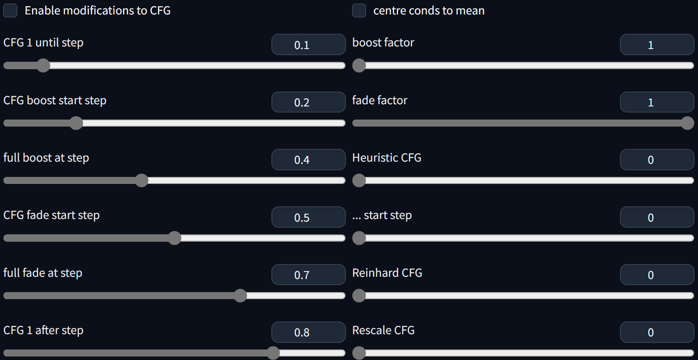

# CFG fade #
### extension for Forge webui for Stable Diffusion ###

---
## Install ##
Go to the **Extensions** tab, then **Install from URL**, use the URL for this repository.

---
#### 25/06/2024 ####
added/corrected saving of parameters: now they get written to *params.txt* too

### update 15/05/2024 ###
Now I also patch the main sampling function, to calculate the new CFG there. This means that processing of the uncond can be skipped for low CFG, which is a free performance gain. Speed up depends on proportion of steps that end up with CFG <= 1.0. As far as CFG boost/fade is concerned, results are identical. Heuristic CFG and Reinhard CFG use the uncond for their calculations, but now they have to be skipped on steps when it is not available, so results from them can change. The difference seems minor; I tested an option to force uncond calculation but decided it was unnecessary.

---
### screenshot of UI ###

---
## Basic usage ##
A variety of ways to adjust CFG dynamically. Some are effective.
Settings used are saved with metadata, and restored from loading through the **PNG Info** tab.

---
## Advanced / Details ##
centre conds to mean: a simple calculation to keep channel average centered around zero. Often seems like a free quality win.

CFG 1 until/after step: Sets CFG to 1.0 for early/late steps. Normally seen based on sigmas, but done by step here for consistency with the other settings. This is higher priority than boosting/fading.

CFG boost: a linear scaling increase to weight applied to CFG

CFG fade: a linear scaling decrease to weight applied to CFG. Ranges of boost/fade can overlap.

Heuristic CFG: 0 is disabled. Set higher than actual CFG to increase contrast, details, sharpness; or lower for the opposite. Delaying the start can allow pushing harder, but setting too high will cause burning.

Reinhard Target CFG: 0 is disabled. Uses Reinhard tonemapping to dynamically adjust CFG. Could allow using higher CFGs than normal.

Rescale CFG: 0 is disabled, best seems typically to be 0.5-0.75. Often a free win.

---
## To do? ##
1. perp_neg? The [Neutral Prompt extension](https://github.com/ljleb/sd-webui-neutral-prompt) is already aiming to cover this
2. slew limiting: not convinced by this. Seems better overall to limit change using the scheduler, though the effects are different.
3. different tonemappers
4. XYZ support

---
## License ##
Public domain. Unlicense. Free to a good home.
All terrible code is my own. Use at your own risk.

---
## Credits ##
Thanks to Alex "mcmonkey" Goodwin for the Dynamic Thresholding extension (Forge built-in version). I started this project with zero knowledge, and this source got me started. The first - basic, unreleased - version was essentially hacked out of that extension.

Also thanks to https://github.com/Haoming02. I learned a lot about how to implement this from their work.

rescaleCFG and Reinhard tonemapping based on https://github.com/comfyanonymous/ComfyUI_experiments/

[combating-mean-drift-in-cfg (birchlabs.co.uk)](https://birchlabs.co.uk/machine-learning#combating-mean-drift-in-cfg)

---

> Written with [StackEdit](https://stackedit.io/).
